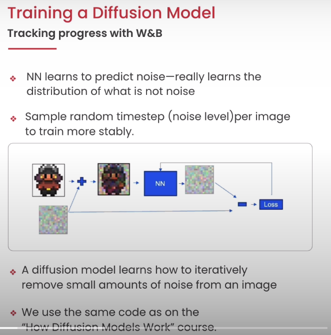

# Notes on Evaluating and Debugging Generative AI - Weights & Biases

[ref](https://learn.deeplearning.ai/courses/evaluating-debugging-generative-ai/lesson/1/introduction)

0. Introduction 
1. Instrument W&B
2. Training a Diffusion Model with W&B
3. Evaluating Diffusion Model
4. LLM Evaluationand Tracing with W&B
5. Finetuning a Language model
6. Conclusion

### 0. Introduction 

### 1. Instrument W&B
  

### 2. Training a Diffusion Model with W&B
  
   
For diffusion models, the loss flatens out very quickly. However, small improvement in the loss improves the quality of the image by a lot. So, we need to sample the images during training.

### 3. Evaluating Diffusion Model
  
 

### 4. LLM Evaluationand Tracing with W&B
  
 
  
**using API with tables** could be used for creating a table with system prompts, user prompt, response, and custom functions like cost, time, etc.
 
 

**LLM Tracer** It is a tool that allows you to trace a chain (from Langchain) with the help of TraceTimeline.
 
 

**Tracking LangChain Agents** It is a tool that allows you to trace an agent (from Langchain).

### 5. Finetuning a Language model
  
This allows you to keep track of the training process and to see the results of the training in real time.
