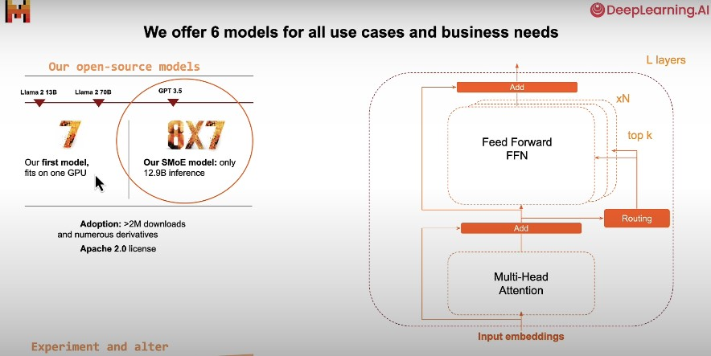
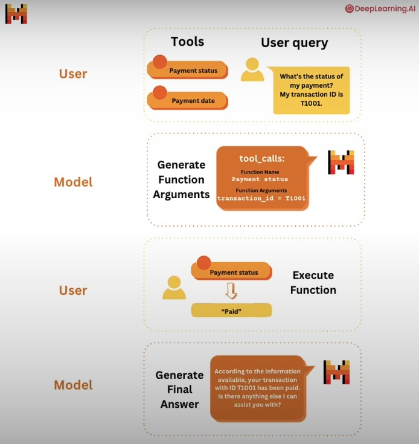
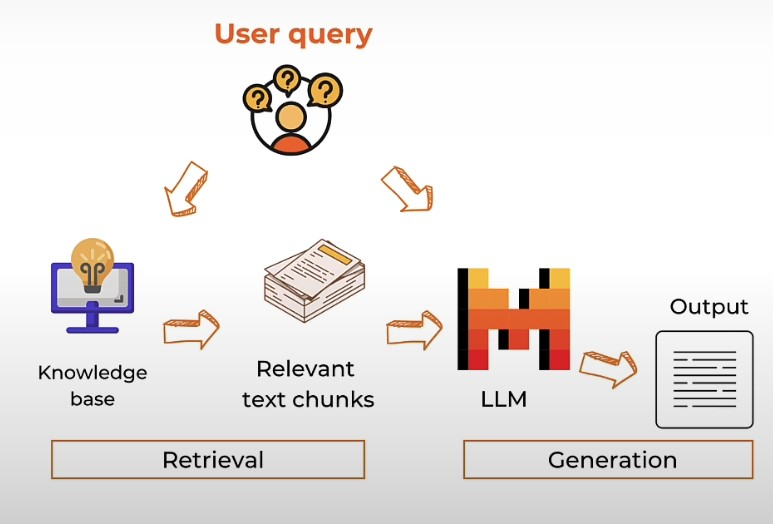

# Functions, Tools, and Agents with LangChain

These notes are from the DeepLearning.ai course on [Getting started with Mistral](https://learn.deeplearning.ai/courses/getting-started-with-mistral/lesson/1/introduction)

The topics covered in the lectures are as follows:
1. Introduction 
2. Overview
3. Prompting
4. Model Selection
5. Function calling 
6. RAG from scratch 
7. Chatbot
8. Conclusion

## 1. Introduction 
- Mixtral 8X7B - misture of expert - 8 feed forward neural networks
- At inference, a gating neural network chooses to activate 2 out of the 8 experts to predict the next token
- It then takes a weighted average of these 2 experts to generate the next token 
- Low inference cost 
- Total Parameters 46.7B parameters, at inference it  uses only 12.9B parameters
- Key Features covered - function calling and JSON mode
- Open Scource Models - Mistral 7B, Mixtral 8X7B
- Commercial Modles: Mistral Small, Mistral Medium, Mistral Large

## 2. Overview
- Open Scource Models (Apache 2.0 License)
    - Mistral 7B "open-mistral-7b"
    - Mixtral 8X7B "open-mixtral-8x7b"
        - Architecture of a usual LLM: Multi-Head Attention, Feed-Forward Layer (FFN)
        - Architecture of a MOE: Multi-Head Attention, FFN X 8, Router
        - Total Parameters 46.7B parameters, at inference it  uses only 12.9B parameter=

- Commercial Modles: 
    - Mistral Small "mistral-small-latest": for low latency
    - Mistral Medium "mistral-medium-latest": for language based task 
    - Mistral Large "mistral-large-latest": for most sophisticated needs
        - It is natively fluent in English, French, Spanish, German, and Italian 
        - 32k Context window
        - **precise instruction following** enables developers to design their **moderation policies**
        - Natively capable of function calling
    - embedding model

- Local Model runs:
    - transformers
    - llama.cpp
    - ollama

- Mistral Links 
    - Chat Interface [La Chat](chat.mistral.ai)
    - Mistral API calls [La Plateforme](console.mistral.ai)

## 3. Prompting
- Load API key and helper function for API calls
- classification prompt with few show 
    - Seperate instruction, few shot examples, and User Inquiry in seperate sections
- Spell check on prompt
- JSON Mode
    - "return in JSON format" in prompt
     - few shot examples in JSON format
     - in API call, "is_json = TRUE"
- Personalization
- Summarization

## 4. Model Selection
- "open-mistral-7b"
- "open-mixtral-8x7b"
- "mistral-small-latest"
    - Simmple classification
- "mistral-medium-latest"
    - custom email create
- "mistral-large-latest"
    - complex reasoning question
    - coding task
    - classification of multiple text
    - coding question

## 5. Function calling 
- 4 steps for function calling:
    1. define tools and user query
        - a tool could be a function or an external api
        - a user query comes from the user
        - (in this step the function and the srgument definition is given in the prompt)
    2. model generates function name and arguments 
    3. user executes the function to get the results
    4. generate final answer
- Code implementation

## 6. RAG from scratch 
- Steps for RAG:
    1. Load the Documents
    2. Chunk the documnets
        - choose the chunk size 
        - choose ways to split the text 
    3. Create embeddings for the chunks 
    4. Save the embeddings in a Vector Database (eg. faiss)
    5. User asks a question
    5. Create embedding for the user question 
    6. Retrive text chunks from the vector database that are close to the user question
        - seacrh for the text chunks 
        - select the top k results
        - (There are a lof of retrieval strategioes, such as, similarity search, BM25, etc.)
    7. Add the retrieved text chunks and user question to the prompt 
    8. Generate the response

- We could use RAG logic in a function call

## 7. Chatbot
- Chat UI package **panel**
- Chatbots built
    - basic chat interface 
    - link of an article and chat with the article
    - upload a document and chat with the document

## 8. Conclusion
