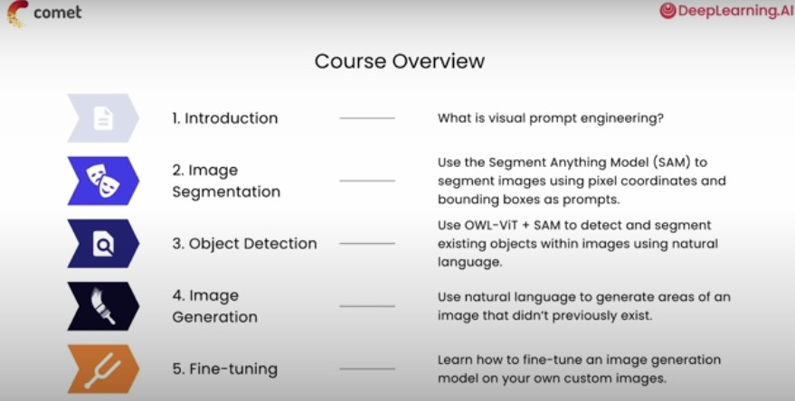
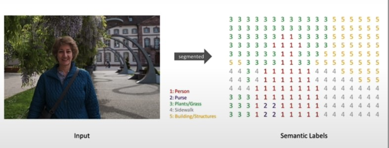
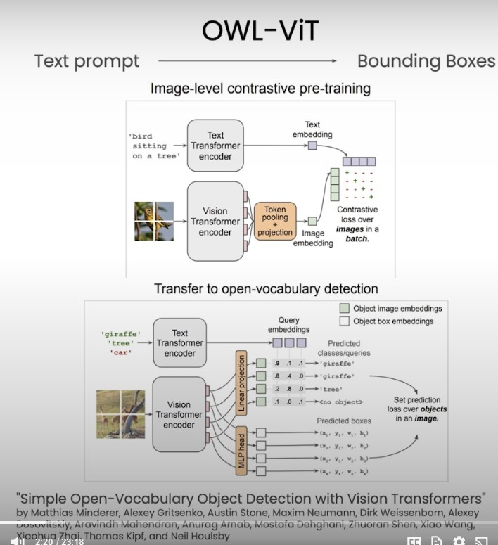

# Prompt Engineering for Vision Models

These notes are from the DeepLearning.ai course on [Prompt Engineering for Vision Models](https://learn.deeplearning.ai/courses/prompt-engineering-for-vision-models/lesson/1/introduction)

The topics covered in the lectures are as follows:
1. Introduction 
2. Overview
3. Image Segmentation
4. Object Detection
5. Image Generation 
6. Fine-Tuning
7. Conclusion
8. Appendix

- Prompt engineering for vision models can be used to caption images, segment objects, or generate images.
    - In this course, you will learn how to prompt a segmentation model called Sam to identify the outline of an object in an image.
    - You can also prompt the model by marking a few points in the image or specifying a boundary box containing the object.
- Prompt engineering can be used to generate images with text prompts.
    - For instance, you can provide the text prompt "a dragon" to the stable diffusion model to generate an image of a dragon.
    - You can iterate on that prompt, for instance by adding "realistic Green Dragon" to get a different image of a dragon.
- You will also learn about inpainting, which is combining image segmentation and a diffusion model to replace parts of an image with a generated image.
    - For inpainting, your prompt will be both a text prompt (e.g., a realistic Green Dragon) and also an outline of a cat that the dragon will replace.
- Prompt engineering allows you to combine multiple image models to carry out more complex image transformations.
    - In the course, you will learn how to combine a segmentation model (S) to cut out an object and a diffusion model (stable diffusion) for generation.
- You will also learn how to tune model hyperparameters to improve image manipulation.
    - One such parameter is the guidance scale, which determines how closely the diffusion model follows the text prompt.
    - A lower guidance scale will allow the model to sample more freely, whereas a higher guidance scale will result in an image that more closely matches the text prompt.
- You can use a fine-tuning technique called jeam boo to personalize the diffusion model to generate images of specific objects or people.

## 1. Introduction
- Embedding techniques for text and images - CLIP and ALIGN
- Prompt wngineering workflows
- Comet experiment tracking
    - Data Versioning
    - Model Architecture
    - Model Fine-Tuning
    - Model Versioning 
    - (Model Evaluation will be visual as evaluation parameter might not tell the full story)

## 3. Image Segmentation
- Segment Anything Model (SAM) is a universal image segmentation model that can be used for downstream segmentation tasks through positive and negative prompting
- Image Segmentation - segments am image intyo discrete groups of pixels for different objects

- LAB: Create segmentation or object detection in an image using positive and negative points as input using FastSAM model.

## 4. Object Detection
- Object Detection - Create segmentation or object detection in an image using a **text prompt** instead of points as input.
- LAB pipeline:
    - Zero shot object detection model (OWL-ViT model - it is a zero shot model that detects bounding bozes with a text prompt)
    - followed by, MobileSAM model (alternatives FastSam, SAM)

## 5. Image Generation
- Use Stabel Diffusion to perform inpainting using Diffusion Model

## 6. Fine-Tuning
- Teach stable diffusion to generate something that it has never seen before by fine-tuning it using DreamBooth and LoRa.
- DreamBooth

## 7. Conclusion
