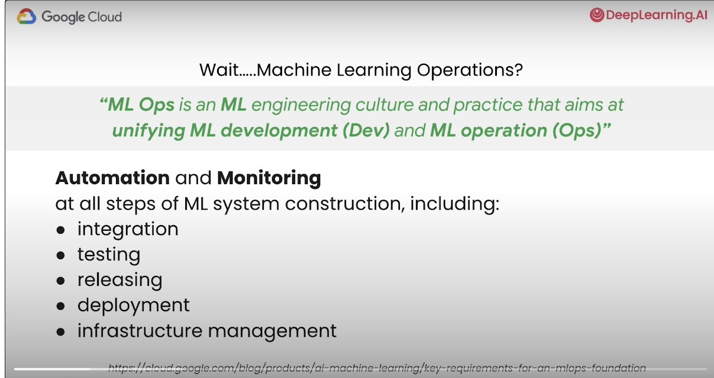
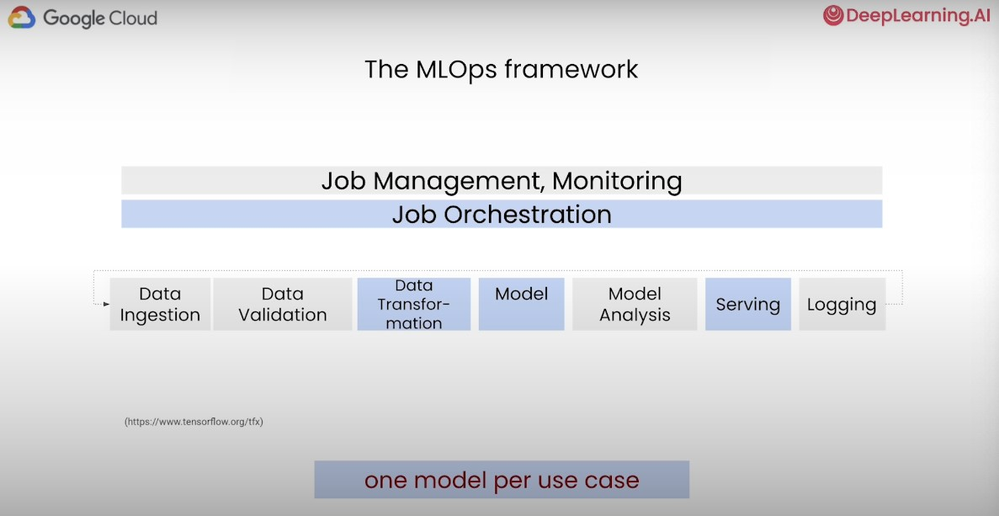
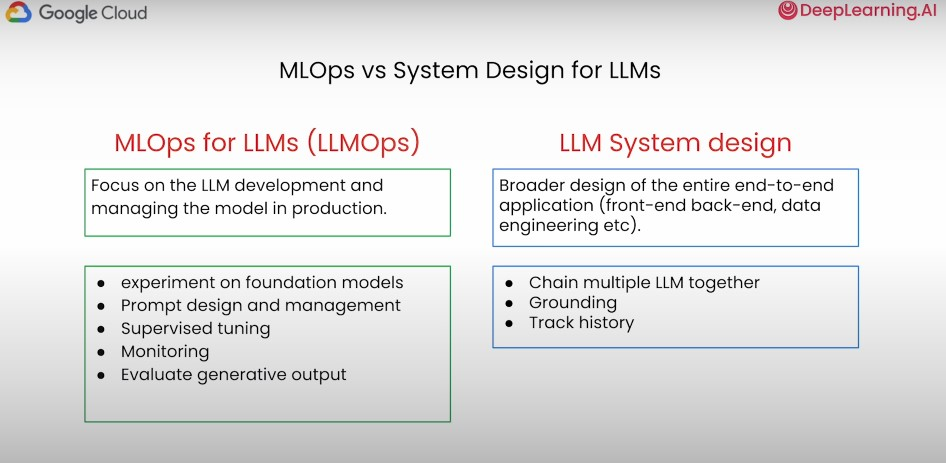
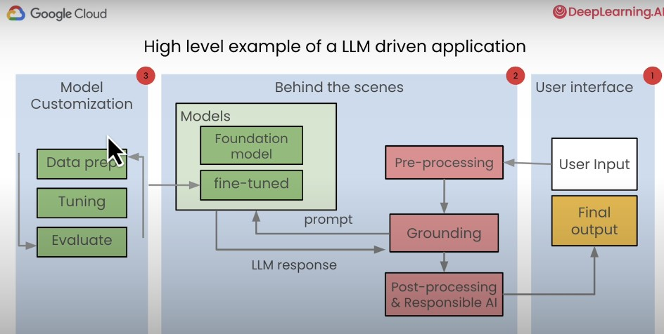
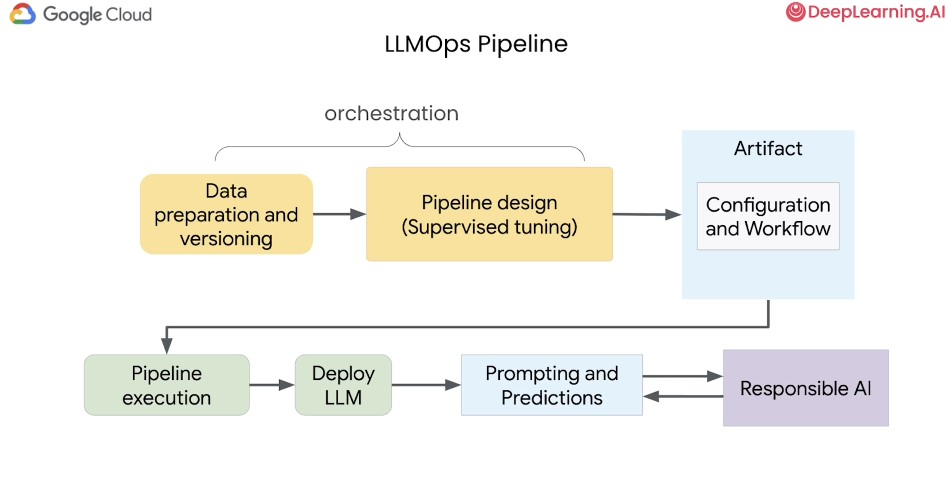
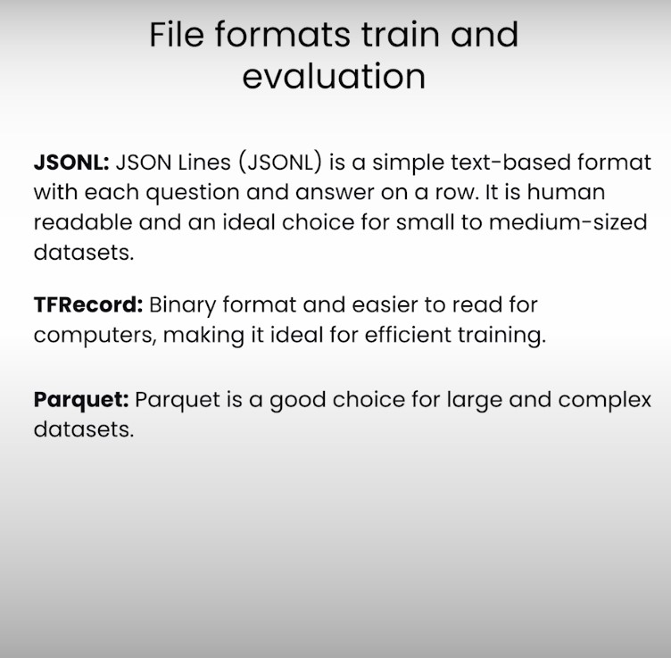
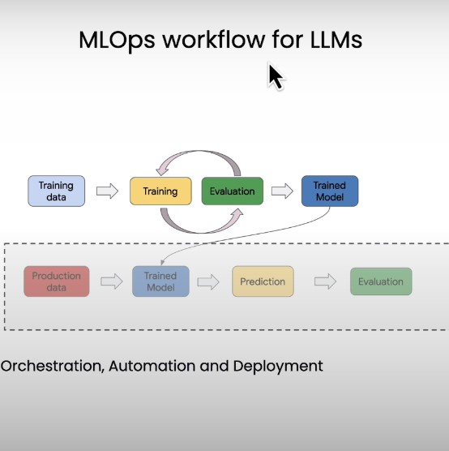
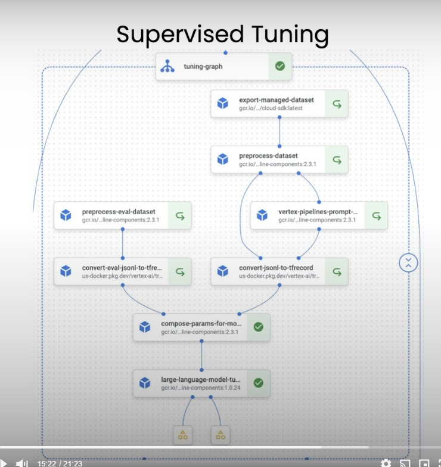

# Summary of LLM Ops Course by Google

## Introduction to MLOps
MLOps, or Machine Learning Operations, is a practice for collaboration and communication between data scientists and operations professionals to help manage the production machine learning (ML) lifecycle. This course covers the fundamentals of MLOps, focusing on the automation, orchestration, and deployment of ML models.

## Key Learnings and Takeaways

### Module 1: Fundamentals of MLOps
- **MLOps Principles**: Understanding the key principles of MLOps including reproducibility, automation, and continuous integration/continuous deployment (CI/CD).
- **MLOps Lifecycle**: Overview of the ML lifecycle stages - data preparation, model training, model evaluation, model deployment, and model monitoring.
- **Collaboration**: Emphasizes the importance of collaboration between data scientists and operational teams to ensure seamless model deployment and monitoring.

 
 
 
 
 

### Module 2: Data Preparation
- **Data Retrieval and Storage**: Techniques to efficiently retrieve and store large datasets. Using cloud storage solutions like Google Cloud Storage for managing big data.
- **Data Cleaning and Transformation**: Best practices for cleaning and transforming data to ensure quality input for ML models.
- **Data Versioning**: Importance of versioning data to maintain reproducibility and traceability in ML experiments.

### Module 3: Model Training and Tuning
- **Training Workflows**: Creation of efficient training workflows using tools like TensorFlow and Keras.
- **Hyperparameter Tuning**: Methods for hyperparameter tuning to optimize model performance.
- **Experiment Tracking**: Tools and practices for tracking experiments to understand the impact of different parameters on model performance.

### Module 4: Automation and Orchestration
- **Orchestration Tools**: Introduction to orchestration tools like Apache Airflow and Kubeflow Pipelines for managing ML workflows.
- **Automation**: Automating repetitive tasks in the ML lifecycle to improve efficiency and reduce human error.
- **CI/CD for ML**: Implementing continuous integration and continuous deployment practices for ML models to ensure robust and reliable deployment pipelines.

### Additional Resources
- **Google Cloud Vertex AI**: Utilization of Vertex AI for managing ML models in a production environment.
- **BigQuery**: Leveraging BigQuery for data analysis and preparation at scale.
- **Open Source Tools**: Adoption of open-source tools and frameworks to build scalable and maintainable ML pipelines.

## Conclusion
The course provides a comprehensive understanding of MLOps, emphasizing the importance of automation, orchestration, and collaboration in managing ML projects. By following the best practices and utilizing the right tools, one can efficiently deploy and maintain ML models in production, ensuring continuous delivery and improvement.

---

### Complimentary Information
- **MLOps vs DevOps**: MLOps extends the principles of DevOps to machine learning projects, focusing more on the data and model aspects rather than just code and infrastructure.
- **Future Trends**: With the rise of generative AI and large language models, the complexity of managing ML projects is increasing, making MLOps practices even more critical.

---
