## Lecture 1: Introduction to Text Embeddings

### Key Learnings:
* Text embeddings are powerful tools for representing the meaning of sentences or paragraphs in a high-dimensional space.
* Unlike word embeddings (e.g., Word2Vec), sentence embeddings capture context and meaning at a higher level.
* Embeddings enable various applications such as classification, clustering, and question-answering systems.

### Takeaways:
* The course uses Google Cloud AI platform for demonstrations.
* Embeddings are typically 768-dimensional vectors.
* Cosine similarity is used to measure the similarity between embeddings.

## Lecture 2: Getting Started with Text Embeddings

### Key Learnings:
* How to use the Google Cloud AI platform to compute embeddings.
* The process of authenticating and initializing the embedding model.
* Comparing embeddings of different sentences to understand semantic similarity.

### Takeaways:
* The embedding model used is "textembedding-gecko@001".
* Cosine similarity values tend to fall within a narrow range due to the high dimensionality of the vectors.
* Sentence-level embeddings are more sophisticated than simple word embeddings, capturing word order and context.

## Lecture 3: Understanding Embeddings

### Key Learnings:
* The internal workings of embedding models, including the use of transformer neural networks.
* How embeddings are learned through contrastive learning techniques.
* The concept of multi-modal embeddings that can represent both text and images in the same vector space.

### Takeaways:
* Modern embedding models use context-aware representations of words.
* Embeddings are learned by training on pairs of similar and dissimilar sentences.
* Multi-modal embeddings are an exciting development in the field, enabling new applications.

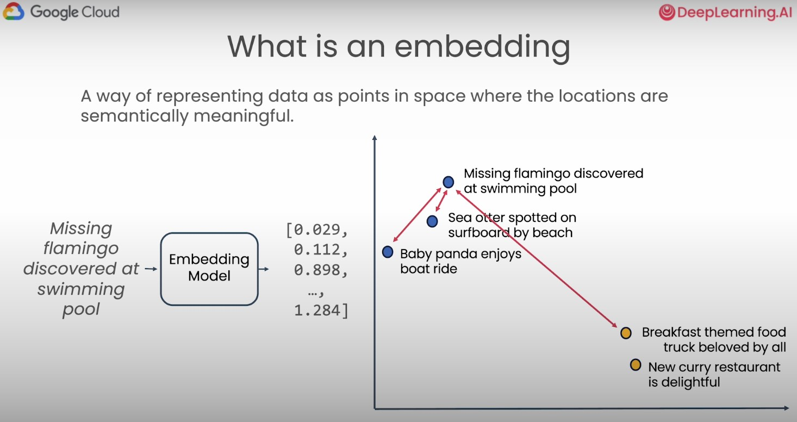 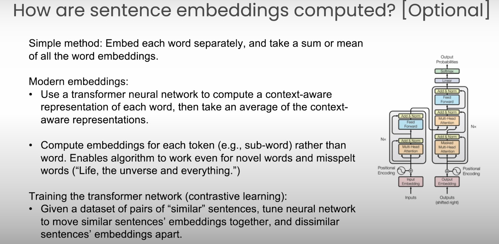 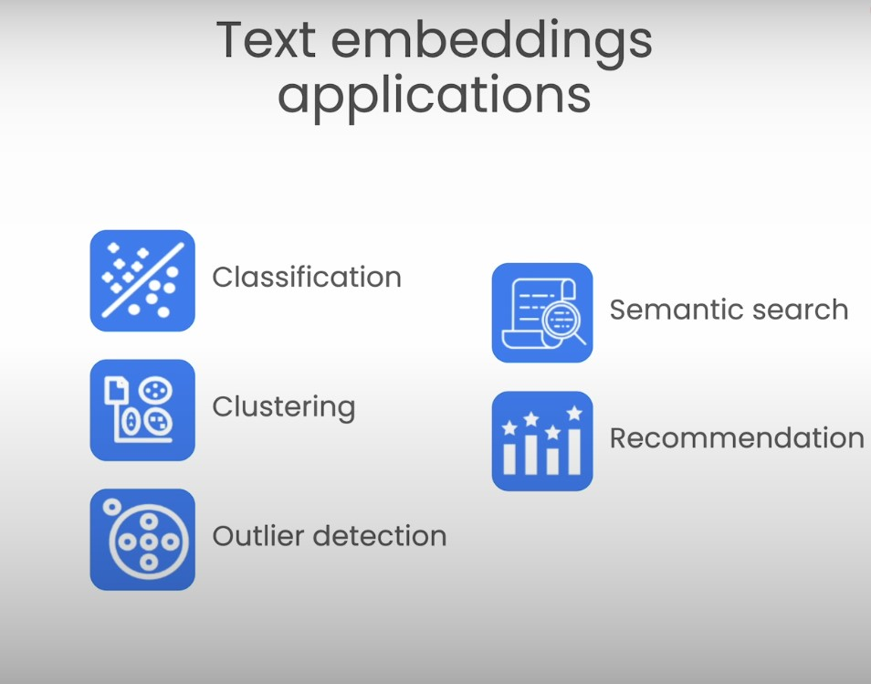 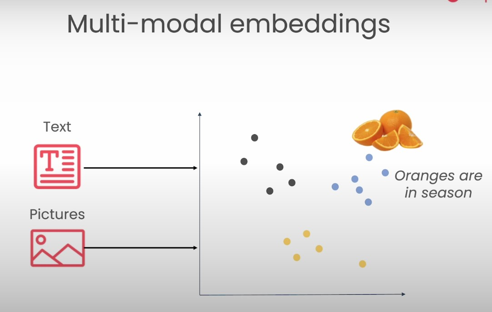 

## Lecture 4: Visualizing Embeddings

### Key Learnings:
* Techniques for visualizing high-dimensional embeddings in 2D space.
* The use of Principal Component Analysis (PCA) for dimensionality reduction.
* How to create and interpret heatmaps of embedding components.

### Takeaways:
* Visualizations are useful for building intuition but are not typically used in practical applications.
* PCA is a common technique for reducing the dimensionality of embeddings for visualization purposes.
* Heatmaps can show patterns in embedding components across different sentences.

## Lecture 5: Embeddings and Applications

### Key Learnings:
1. **Embeddings Basics:**
    * Embeddings are vector representations of text data.
    * They capture semantic meaning in a high-dimensional space.
2. **Data Preparation:**
    * Used Stack Overflow dataset from BigQuery.
    * Importance of batching data for API calls.
3. **Applications of Embeddings:**
    * Clustering: Used K-means to group similar posts.
    * Anomaly Detection: Utilized Isolation Forest to identify outliers.
    * Classification: Employed Random Forest Classifier for categorizing posts.
4. **Visualization Techniques:**
    * PCA for dimensionality reduction to visualize high-dimensional data.
5. **Practical Considerations:**
    * Handling API rate limits.
    * Importance of data preprocessing and splitting for machine learning tasks.

### Takeaways:
* Embeddings are versatile and can be used for various NLP tasks.
* Proper data handling and preprocessing are crucial for working with large datasets.
* Combining embeddings with traditional machine learning algorithms can yield powerful results.

## Lecture 6: Text Generation with Large Language Models

### Key Learnings:
1. **Text Generation Basics:**
    * Large Language Models (LLMs) take text input and produce probable output text.
    * Importance of prompts in guiding model output.
2. **Model Parameters:**
    * Temperature: Controls randomness of output (0 for deterministic, higher for more creative).
    * Top-k: Limits selection to k most probable tokens.
    * Top-p (nucleus sampling): Dynamically limits token selection based on cumulative probability.
3. **Prompt Engineering:**
    * Crafting effective prompts for desired outcomes.
    * Using prompts for tasks like classification, extraction, and formatting.
4. **Model Behavior:**
    * LLMs can adapt to different tasks based on prompt design.
    * Models can extract and reformat information from unstructured text.

### Takeaways:
* Prompt engineering is crucial for getting desired results from LLMs.
* Adjusting parameters like temperature, top-k, and top-p can significantly impact model output.
* LLMs are versatile and can be used for various tasks beyond simple text generation.

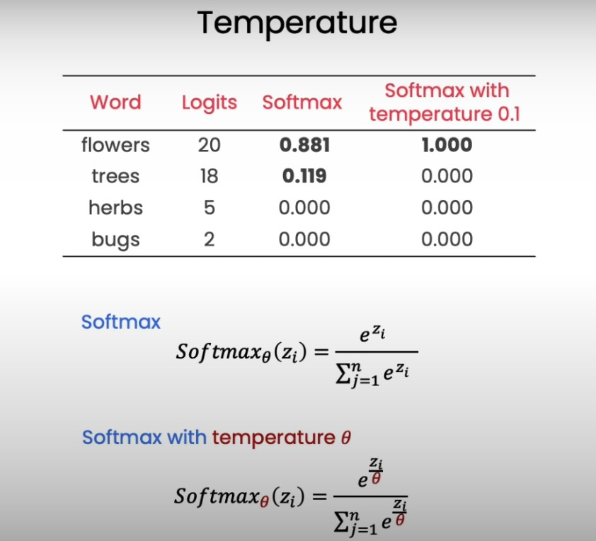   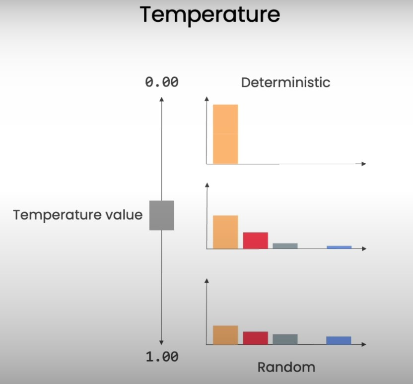 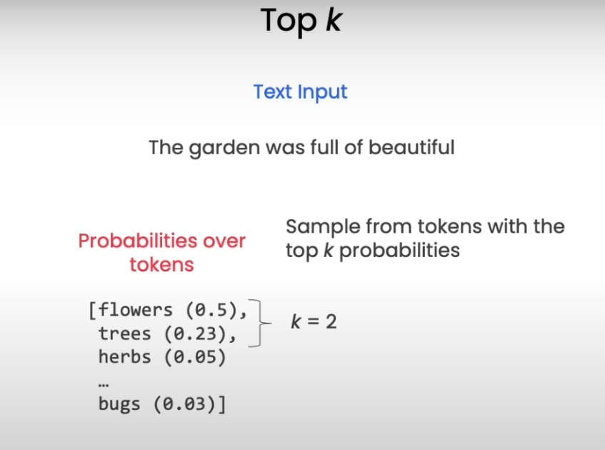 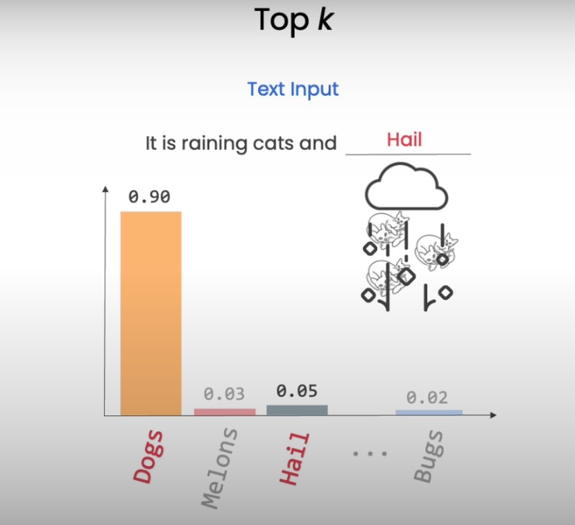 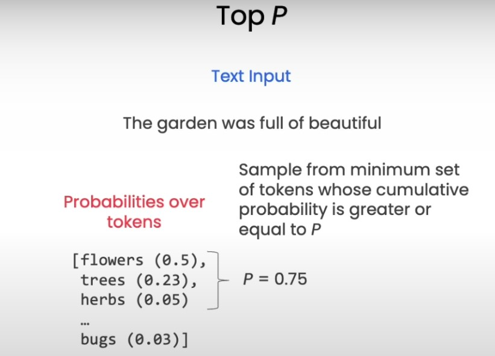  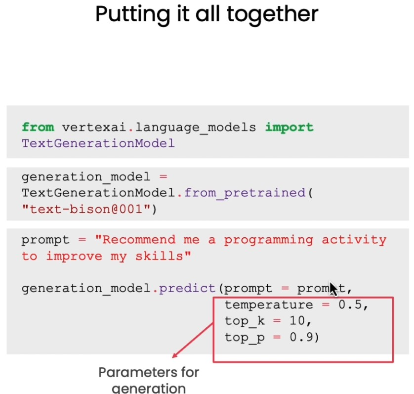 

## Lecture 7: Building a Question Answering System

### Key Learnings:
1. **Combining Embeddings and Text Generation:**
    * Using embeddings to find relevant information in a database.
    * Leveraging text generation to formulate coherent answers.
2. **System Architecture:**
    * Embedding user queries and database entries.
    * Using cosine similarity to find most relevant database entries.
    * Prompting LLM with relevant context to generate answers.
3. **Handling Edge Cases:**
    * Dealing with queries that don't match database content.
    * Using LLM to recognize and respond to out-of-scope questions.
4. **Optimization Techniques:**
    * Introduction to approximate nearest neighbor algorithms (e.g., SCANN).
    * Importance of efficient similarity search for large-scale applications.
5. **Prompt Design for QA Systems:**
    * Structuring prompts to include context and guide model responses.
    * Balancing between providing sufficient context and staying within token limits.

### Takeaways:
* Combining embedding-based retrieval with LLM-based generation creates powerful QA systems.
* Efficient similarity search is crucial for scaling QA systems to large databases.
* Careful prompt design is essential for guiding LLMs to produce relevant and coherent answers.
* Consider edge cases and out-of-scope queries when designing robust QA systems.

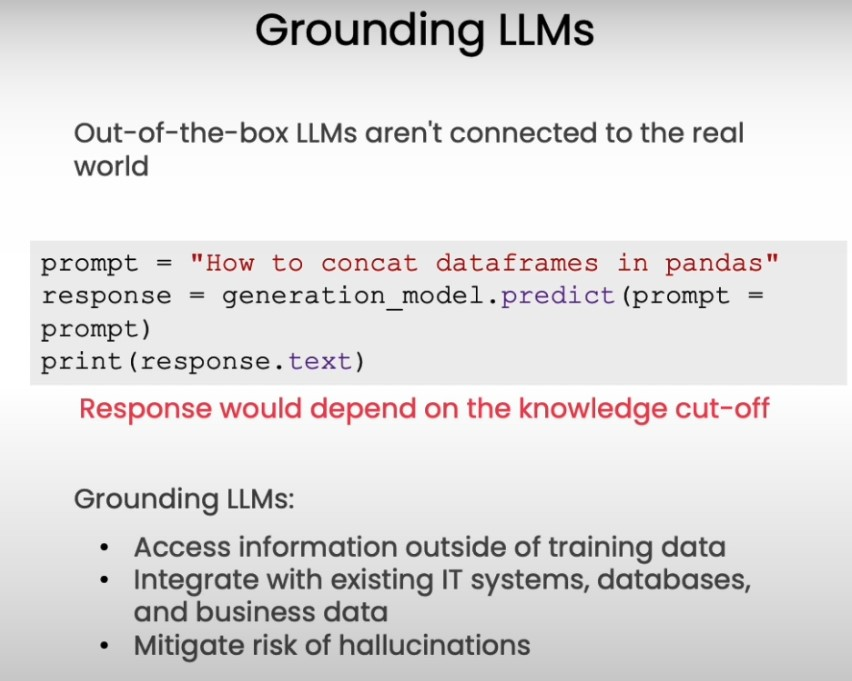  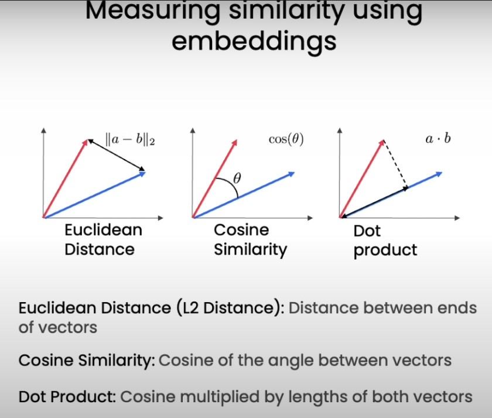 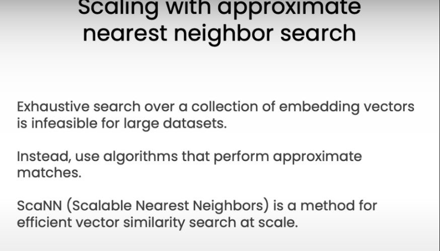 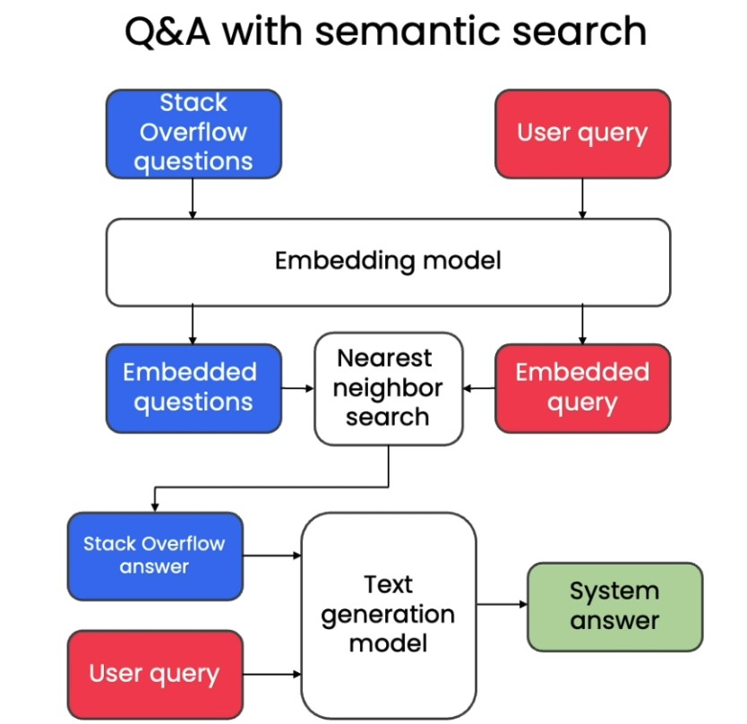

## Additional Information

### Applications of Text Embeddings:
1. **Semantic Search:** Embeddings enable more meaningful search results by matching concepts rather than just keywords.
2. **Content Recommendation:** By embedding user preferences and content, systems can suggest more relevant items.
3. **Sentiment Analysis:** Embeddings can capture the nuanced meaning of text, improving sentiment classification accuracy.
4. **Document Clustering:** Embeddings allow for more sophisticated grouping of similar documents.
5. **Machine Translation:** Embeddings can be used to create language-agnostic representations, aiding in translation tasks.

### Recent Developments:
* **Sentence-BERT:** A modification of the BERT model optimized for generating sentence embeddings, significantly improving performance on various downstream tasks.
* **SimCSE:** A simple contrastive learning framework that creates high-quality sentence embeddings using only unlabeled data.
* **CLIP (Contrastive Language-Image Pre-training):** A multi-modal model by OpenAI that learns to connect text and images, enabling powerful zero-shot capabilities.

### Best Practices:
1. Choose the appropriate embedding model for your specific task and domain.
2. Fine-tune embeddings on domain-specific data when possible for better performance.
3. Regularly update your embedding models to benefit from the latest advancements in the field.
4. Be mindful of biases that may be present in pre-trained embeddings and take steps to mitigate them.
5. Use techniques like cosine similarity or Euclidean distance consistently when comparing embeddings.

By mastering text embeddings, developers and data scientists can unlock powerful capabilities in natural language processing and build more intelligent, context-aware applications.